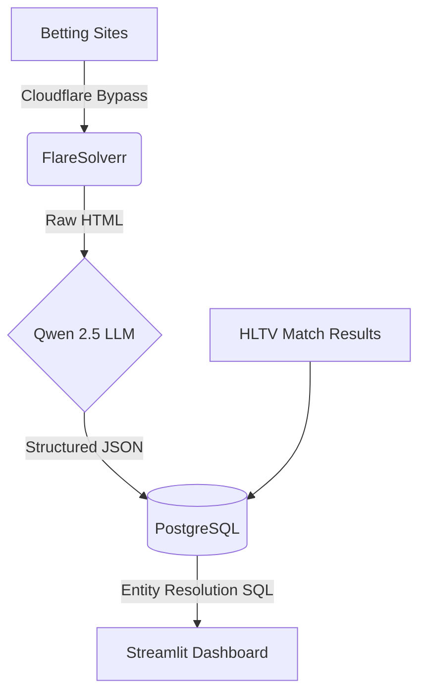

# CS2 Quantitative Odds Dashboard

A full-stack data engineering and quantitative analysis pipeline for Counter-Strike 2 esports betting markets.


## 🚀 Overview
This project continuously scrapes, structures, and analyzes live CS2 betting odds against actual match outcomes. By running an autonomous ETL loop on a home server (Proxmox), it captures bookmaker-implied probabilities, strips the vigorish (bookmaker margin), and flags potential market mispricings in real-time.

**Note:** This repository serves as a static showcase for recruiters. When deployed on Streamlit Community Cloud, it automatically falls back to pre-computed snapshot data to demonstrate full functionality without requiring a live connection to the home database.

## 🏗️ Architecture & ETL Loop

The backend relies on a robust ETL pipeline built to handle dynamic JavaScript-heavy websites and unstructured text:

1. **Scraping Layer (FlareSolverr):** Bypasses Cloudflare protections to extract raw HTML from esports betting markets.
2. **LLM Extraction (Qwen 2.5 via Ollama):** Parses the unstructured HTML locally to extract clean team names, odds, and tournament metadata.
3. **Storage & Resolution (PostgreSQL):** Stores raw odds and match results. Complex SQL joins handle "entity resolution" (matching slightly different team name spellings between the odds provider and the results provider).
4. **Visualization (Streamlit):** A dynamic dashboard that computes true probabilities, calibrates bookmaker accuracy, and visualizes the data.



## 🧠 Key Engineering Highlights

### 1. Vig-Stripping Math
Bookmakers build a profit margin (vigorish or "vig") into their odds. To find the "true" implied probability, we must mathematically remove this margin:

```python
# Implied probability calculation
prob_a = 1 / odds_a
prob_b = 1 / odds_b
total_implied_prob = prob_a + prob_b

# Vig calculation
vig_percent = (total_implied_prob - 1) * 100

# True (vig-free) probability calculation
true_prob_a = (prob_a / total_implied_prob) * 100
true_prob_b = (prob_b / total_implied_prob) * 100
```

### 2. SQL Entity Resolution
Matching betting odds to actual match outcomes is challenging because bookmakers often abbreviate team names differently than official tournament records (e.g., "NaVi" vs. "Natus Vincere"). We handle this via complex SQL joins:

```sql
SELECT
    o.match_title,
    o.team_a, o.team_b,
    o.true_prob_a, o.true_prob_b,
    r.winner, r.loser,
    r.status
FROM scraped_cs2_odds o
JOIN match_results r
    ON (o.match_title = r.match_title OR o.match_title = r.match_title_b)
    AND o.event_name = r.event_name
WHERE r.status = 'completed';
```

### 3. Graceful Degradation (Fallback Data)
To ensure this dashboard remains accessible 24/7 as a portfolio piece, the Streamlit app gracefully catches database connection timeouts and transparently switches to pre-computed pandas DataFrames.

```python
try:
    engine = get_engine()
    df = pd.read_sql(query, engine)
    return df, True
except Exception as e:
    print(f"Database offline. Loading static showcase data.")
    df = pd.read_csv("data/live_odds_fallback.csv")
    return df, False
```

## 🛠️ Local Development

If you have access to the live PostgreSQL database:
1. `python -m venv .venv`
2. `source .venv/bin/activate` (or `.\.venv\Scripts\activate` on Windows)
3. `pip install -r requirements.txt` (ensure packages like `streamlit`, `pandas`, `sqlalchemy`, `psycopg2-binary` are installed)
4. `streamlit run Home.py`

